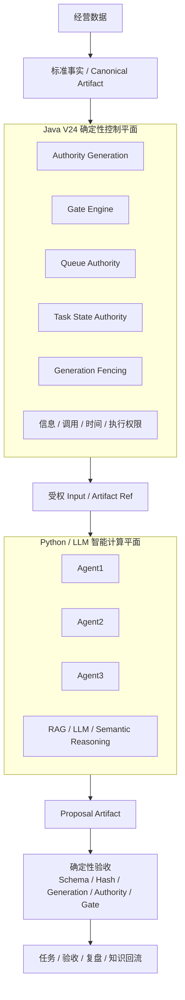
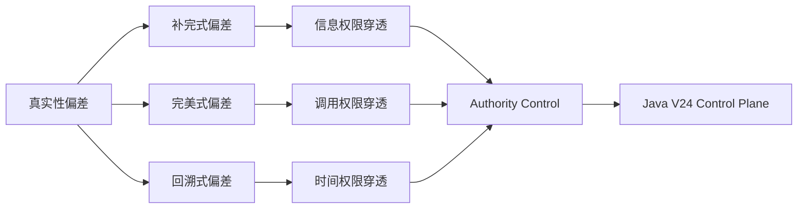
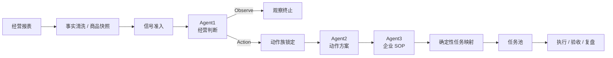
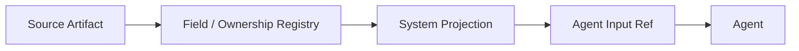
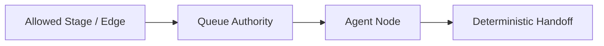
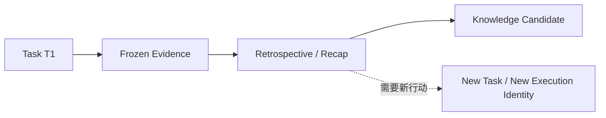
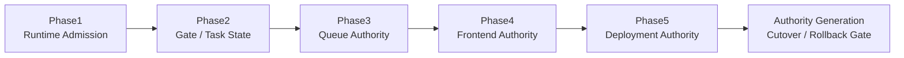
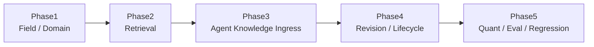
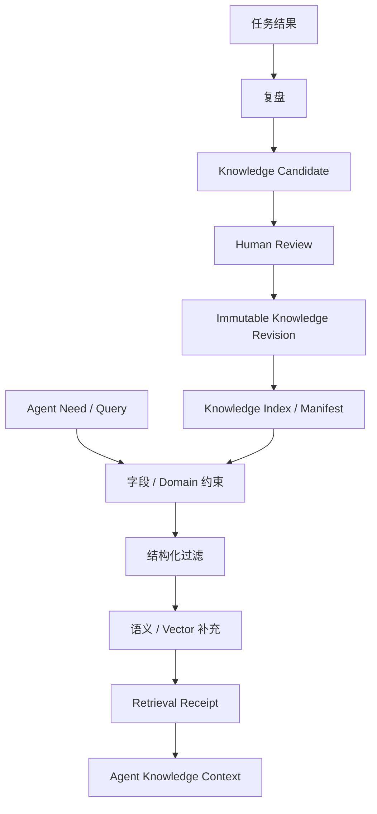

# AI 电商公开版

面向真实电商经营数据的受治理多 Agent 工程实现。

`V26.7 Closeout & SOP Evidence` · `V24 Authority Runtime` · `V25 Knowledge Plane` · `Java Control Plane` · `Python Intelligence Plane`

> 核心原则：**系统拥有调用图，AI 只拥有节点内判断权。**
>
> V24 Java 控制平面包含 Shadow 验证、Authority Generation 与发布门控；**生产写权以 Authority Generation 当前状态为准**。

---

## 1. 系统架构



运行职责：

| 平面 | 主要职责 |
| --- | --- |
| Java Control Plane | 确定性状态、权限、Gate、Queue、Generation、Fencing、CAS、生命周期与发布验收 |
| Python Intelligence Plane | LLM、RAG、Agent 业务判断、语义推理、Prompt / Output Parsing |
| Artifact / Registry | 输入输出引用、Hash、字段 / 接口 / Ownership、血缘与审计 |
| Knowledge Plane | 字段优先检索、知识组合、Revision、Review、Index、Eval / Regression |

---

## 2. 核心技术模型

### 真实性偏差 → 权限穿透

| 真实性偏差 | 典型行为 | 权限穿透 | 工程边界 |
| --- | --- | --- | --- |
| 补完式偏差 | 根据上下文补全未提供信息 | 信息权限穿透 | Information Authority |
| 完美式偏差 | 为完整完成任务扩大 Agent / Stage 调用范围 | 调用权限穿透 | Invocation Authority |
| 回溯式偏差 | 回看已完成任务并重新激活旧链路 | 时间权限穿透 | Temporal Authority |



模型能力可以增强推理质量；事实边界、调用边界、时间边界与执行边界由确定性系统控制。

---

## 3. Java V24 确定性控制平面

```text
java-control-plane/
└── src/main/java/com/zcentury/v24/
    ├── AuthorityGenerationStore.java
    ├── GenerationFencer.java
    ├── GateEngine.java
    ├── QueueAuthority.java
    ├── TaskStateAuthority.java
    ├── CompatibilityAuthority.java
    ├── DeploymentAuthority.java
    ├── FrontendViewAuthority.java
    ├── FrontendSseAuthority.java
    ├── ProductionAuthorityMain.java
    ├── V25KnowledgeRegistry.java
    ├── V25KnowledgeDomainAuthority.java
    ├── V25RetrievalAuthority.java
    └── V25KnowledgeCompositionAuthority.java
```

| 组件 | 工程职责 |
| --- | --- |
| `AuthorityGenerationStore` | 单写者 Authority、CAS、Generation Rotation、持久状态、Rollback、Proof Gate |
| `GenerationFencer` | Generation / Fencing Token 与旧代写入隔离 |
| `GateEngine` | Fail-Closed 确定性门控；未知 Gate 默认 BLOCK |
| `QueueAuthority` | Stage Job、Claim、Lease、Retry、Handoff、Idempotency、Outbox |
| `TaskStateAuthority` | 任务状态与状态迁移 Authority |
| `CompatibilityAuthority` | Python / Java 兼容与迁移边界 |
| `DeploymentAuthority` | 部署状态、CAS 与生产切换边界 |
| `FrontendViewAuthority` / `FrontendSseAuthority` | View Head、Manifest、SSE 投影边界 |
| `V25RetrievalAuthority` | 字段优先检索与语义补充准入 |
| `V25KnowledgeCompositionAuthority` | Agent 知识组合与上下文构造 Authority |

V24 采用 **Shadow → Parity → Authority Generation → Cutover / Rollback** 的迁移路径；Java 实现存在不等于生产写权已自动转移。

---

## 4. Agent 运行链



### 运行硬约束

| 约束 | 状态 |
| --- | --- |
| 完整 Artifact 直接进入模型上下文 | 禁止 |
| Agent Input fallback | 禁止 |
| 模型动态增加 Agent / Stage / 调用边 | 禁止 |
| Agent2 重写 Agent1 主判断 / 动作族 | 禁止 |
| 跨部门协调内容变成当前 Operator 执行步骤 | 禁止 |
| LLM 对 Agent3 SOP 再做任务步骤补写 | 禁止 |
| 旧 Generation 写入新 Runtime | 禁止 |
| 未审核知识直接进入生产 Agent RAG | 禁止 |

最终任务映射采用 `deterministic_agent3_projection_only`，Compiler 不增加 Agent3 未生成的执行步骤。

---

## 5. 权限边界

### Information Authority



- Agent 输入绑定 Source Artifact / Content Hash；
- 完整 Artifact 不直接进入模型 Token Runtime；
- 未注册 / 不允许字段不能通过 fallback 补入；
- 缺失权限参数时 Fail Closed；
- Knowledge / Inference 不拥有自动创建 System Fact 的权限。

### Invocation Authority



Stage、Edge、Claim、Handoff 由系统控制；模型输出不能自行扩张调用图。

### Temporal Authority



历史证据绑定 `dataVersion / frozenAt`；旧任务不通过回溯直接恢复原执行权限。

---

## 6. 工程能力与验证入口

| 工程能力 | 实现锚点 | 可复现验证入口 |
| --- | --- | --- |
| Runtime 精确准入 / 默认拒绝 | Java Phase1 / Runtime Manifest | `scripts/verify_v24_java_phase1.sh` |
| Gate / Task State / Terminal Reopen | `GateEngine` / `TaskStateAuthority` | `scripts/verify_v24_java_phase2.sh` |
| Queue / Claim / Lease / Handoff / Idempotency | `QueueAuthority` | `scripts/verify_v24_java_phase3.sh` |
| Frontend View Head / SSE / CAS | Frontend Authority | `scripts/verify_v24_java_phase4.sh` |
| Deployment / Compatibility / Legacy Retirement | Deployment Authority | `scripts/verify_v24_java_phase5.sh` |
| Authority Generation / CAS / Tamper / Rollback | `AuthorityGenerationStore` | `scripts/verify_v24_authority_generation.sh` |
| Runtime Generation Barrier | Generation Registry / Barrier | `scripts/verify_runtime_generation_barrier_v1.py` |
| Runtime Callable Ownership | Callable Authority + Hash Lineage | `scripts/verify_runtime_callable_authority.py` |
| Agent3 跨部门权限隔离 | Agent3 System Contract | `scripts/verify_agent3_cross_department_coordination_contract.py` |
| 任务历史冻结 | Canonical Task Evidence | `scripts/verify_task_evidence_canonical_history.py` |
| V25 字段 / Domain Authority | V25 Java Phase1 | `scripts/verify_v25_java_phase1.sh` |
| V25 Field-First Retrieval | `V25RetrievalAuthority` | `scripts/verify_v25_java_phase2.sh` |
| V25 Agent Knowledge / Artifact Ingress | V25 Java Phase3 | `scripts/verify_v25_java_phase3.sh` |
| V25 Knowledge Input Contract | Unified Knowledge Envelope | `scripts/verify_v25_agent_input_ingress.py` |
| V25 Immutable Revision / Lifecycle / Review | V25 Java Phase4 | `scripts/verify_v25_java_phase4.sh` |
| V25 RAG Quant / Eval / Regression Gate | V25 Java Phase5 | `scripts/verify_v25_java_phase5.sh` |
| Release Hash Seal / Attestation | Release Contract | `scripts/check_release_contract.py` |

验证状态以脚本实际退出码和生成的 Verification Report / Hash 为准。

### V24 验证阶段



### V25 验证阶段



---

## 7. V25 统一知识平面



工程约束：

- `Field First`：精确字段 / 结构化层优先于语义补充；
- `Retrieval Receipt`：检索结果绑定 Revision 与 Index Manifest；
- `pending_review` 不进入生产检索；
- Human Review 后创建 / 激活不可变 Revision；
- 旧 Revision 保留，不原地覆盖；
- EvalSet / EvalRun 版本化，BASE / TARGET Regression Gate 阻断退化；
- Retrieval 不得自动创建 System Fact。

---

## 8. 仓库结构

```text
.
├── java-control-plane/   # Java 确定性控制平面
├── src/                  # Python 智能计算与业务服务
├── contracts/            # 字段 / 接口 / Ownership 注册表
├── governance/           # Authority / Hash / Lineage / Policy
├── config/               # Runtime / Registry 配置
├── fixtures/             # 脱敏测试与公开数据
├── scripts/              # 构建、验证、迁移与发布脚本
├── release/              # Release Hash Seal / Attestation
├── tests/                # Contract / Runtime / Regression 测试
├── web_demo/             # 公开演示前端
└── docs/                 # 架构与工程文档
```

---

## 9. 运行与验证

### 环境

- Java 17+
- Python 3.11.9（正式运行与发布验证）
- FastAPI
- SQLite / Runtime Adapter
- LLM Provider

### Release Hash 与不可变发布包

正式运行使用 Python `3.11.9`。`requirements.lock` 固定生产依赖，`requirements-dev.lock` 固定验证环境依赖；依赖安装与严格校验遵循发布工作流。

发布沿用 [Release Hash Seal 工作流](.github/workflows/release-hash-seal.yml)：绑定精确 Source Commit，完成静态合同、路由烟雾、测试和依赖校验，再生成 Manifest 与不可变发布包。ECS 使用固定 Root Verifier 验证该包，部署后通过 `/api/system/release-identity` 检查运行身份。

| 发布身份 | 验证含义 |
| --- | --- |
| `runtimeFiles` / `attestedFiles` | 运行文件与合同、测试源码的精确集合及内容 Hash |
| `testEvidenceFiles` / `testRunHash` | CI 实际产生的验证证据集合及其复算 Hash |
| `runtimePipFreezeHash == pipFreezeHash` | 当前运行依赖与发布时记录的依赖一致 |
| `evidenceSemanticVerified == true` | 证据内的 Commit、Python 环境、依赖与合同源码摘要属于当前发布 |
| `releaseHash` / `manifestHash` | 发布包与 Manifest 的内容身份 |

专项验证通过、发布封包成功和 ECS 生产切换分别验收；发布包生成不代表生产权限已转移。完整规则见 [发布合同](docs/V22.4.0_RELEASE_HASH_SEAL.md)。

### 基础测试

```bash
pytest -q
```

### V24 Java Control Plane

```bash
bash scripts/verify_v24_java_phase1.sh
bash scripts/verify_v24_java_phase2.sh
bash scripts/verify_v24_java_phase3.sh
bash scripts/verify_v24_java_phase4.sh
bash scripts/verify_v24_java_phase5.sh
```

Authority Generation 验证需要精确 Source Commit 与 Java Home：

```bash
export V24_SOURCE_COMMIT="$(git rev-parse HEAD)"
export V24_JAVA_HOME="${JAVA_HOME}"
bash scripts/verify_v24_authority_generation.sh
```

### Runtime Authority / History

```bash
python3 scripts/verify_runtime_generation_barrier_v1.py
python3 scripts/verify_task_evidence_canonical_history.py
python3 scripts/verify_agent3_cross_department_coordination_contract.py
```

`verify_runtime_callable_authority.py` 需要由精确 Runtime Hash Lineage Graph 提供 `--lineage-graph` 参数。

### V25 Knowledge Plane

```bash
bash scripts/verify_v25_java_phase1.sh
bash scripts/verify_v25_java_phase2.sh
bash scripts/verify_v25_java_phase3.sh
bash scripts/verify_v25_java_phase4.sh
bash scripts/verify_v25_java_phase5.sh
```

---

## 10. 版本演进

```text
V22  Python Agent Runtime
V23  Hard Interface / Registry / Artifact
V24  Java Deterministic Authority Runtime
V25  Unified Knowledge Plane
V26  Authority Business Graph / Review / Local Revision
V26.7  Closeout hardening / SOP evidence disclosure
```

---

## 11. 技术说明与授权

本仓库公开 AI 电商业务实现、工程设计与部分治理能力；通用 Z-Century 技术体系的独立实现不在本仓库公开范围内。

- [`LICENSE`](./LICENSE)
- [`Z_CENTURY_TECHNOLOGY_NOTICE.md`](./Z_CENTURY_TECHNOLOGY_NOTICE.md)

---

## 12. 联系方式

**商务联系**  
225447370@qq.com

**技术探索 / 交流**  
2254473740

## V26.7 收口更新

任务详情的 SOP 增加可展开的数据来源、冻结快照变化公式、结构化决策记录和任务关联知识审核记录。运行时生成证据，读取时验证并展示；缺失记录不补造，计划参数不冒充计算值，知识召回不冒充效果提升。

本次同时修复数值、图依赖、缓存身份、生命周期持久化与状态锁、验收条件覆盖及局部修订范围。沿用现有 V26 字段权限 / 注册表血缘 PR 门控及 Release Hash Seal，生产 Java 写权仍以原 Authority Generation 切换门控为准。

完整范围、验证与运行边界见 [V26.7 收口说明](docs/V26_7_CLOSEOUT.md)。

### V26.8 证据连续性（首批）

SOP 增加任务产出知识的后续复用记录与可复算成功占比，明确样本范围、无效记录和缺失证据。该占比是结果记录的描述统计，不冒充 RAG 因果效果。交付范围与后续接线见 [V26.8 证据连续性](docs/V26_8_EVIDENCE_CONTINUITY.md)。
